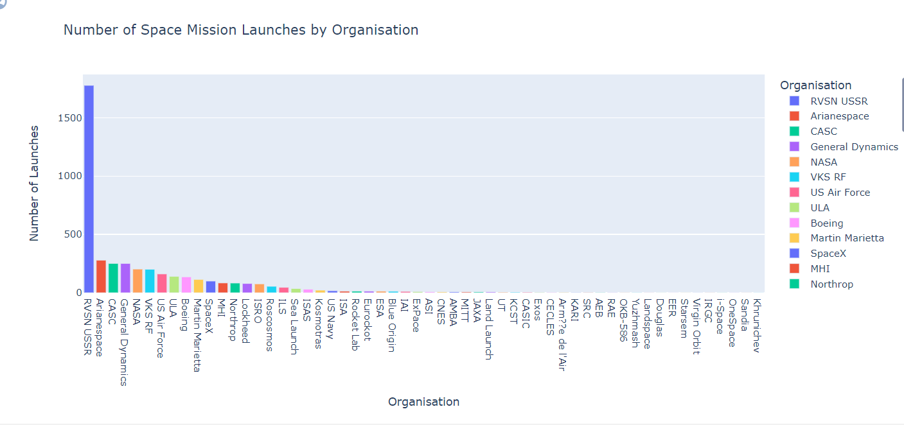

# Space Mission Data Analysis
This repository created with Google Colab for analyzing a dataset of space missions. The dataset was scraped from nextspaceflight.com and includes information about space missions since the beginning of the Space Race in 1957.The dataset spans from the beginning of the Space Race in 1957 to the present day and covers various aspects of space missions, including launch details, organizations involved, mission status, and more.

## Technology Used
- Bar
- Histogram
- Choropleth Map
- Plotly Sunburst Chart 


## Getting Started
To run the code and reproduce the analysis, follow these steps:
- Install the iso3166 package:

    ``` %pip install --upgrade plotly ```
- Upgrade Plotly (if using Google Colab):

  ``` %pip install --upgrade plotly ```

- Import the necessary libraries:

  ```
  import numpy as np
  import pandas as pd
  import plotly.express as px
  import matplotlib.pyplot as plt
  import seaborn as sns
  from iso3166 import countries
  from datetime import datetime, timedelta
   ```

- Load the data:

  ``` df_data = pd.read_csv('mission_launches.csv') ```

  ## Screenshots
     - **Number of Launches per Company:**
        <div align="center"></div>
     
     - **Number of Active versus Retired Rockets:**
       <div align="center"></div>

     - **How Expensive are the Launches?:**
      <div align="center"></div>

    - **The Number of Launches by Country:**
      <div align="center"></div>
 
   - **The countries, organisations, and mission status:**
     <div align="center"></div>
